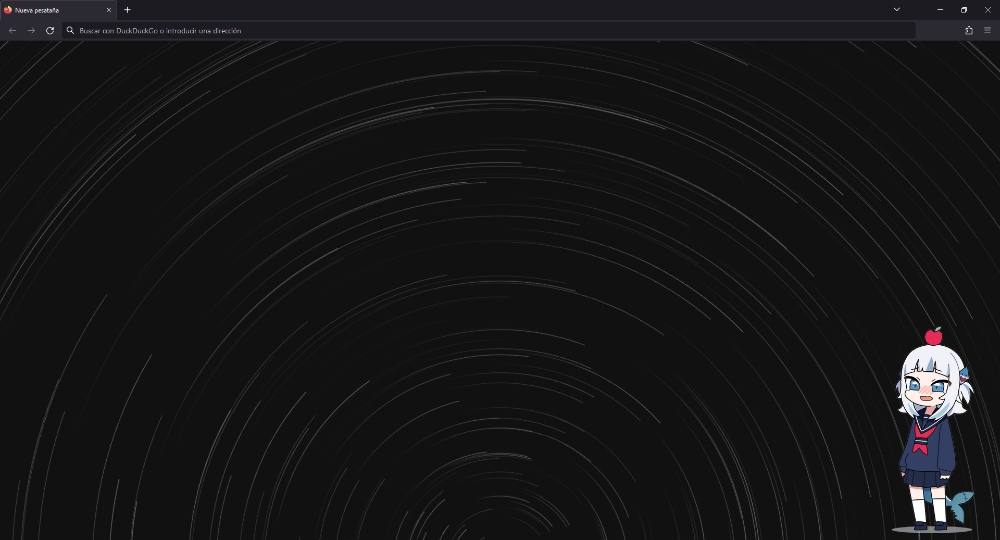

# Start Page Personalizada
Página de inicio personalizada que me hice porque  la predeterminada de Firefox es una basura.
Consiste en una página vacía con star trails (sendas estelares) girando, usando como centro de rotación el centro del borde inferior de la ventana.
También tiene una imagen de Gura en la esquina inferior derecha.



## Gura
La imagen graciosa de Gura que aparece abajo a la derecha cambia si se cumplen algunas condiciones.

* De septiembre a mayo (ambos incluidos) Gura se viste de colegiala por ser época de curso escolar
* De junio a agosto (ambos incluidos) Gura se pone bañador por ser verano y estar de vacaciones
* Cada vez que se actualiza la página, hay un 10% de probabilidades de que Gura se ponga su sudadera de tiburón
* De la misma forma, hay otro 10% de probabilidades de que Gura se vuelva malvada
* Si no se encuentran las demás imágenes de Gura, la sudadera de Gura pierde la textura y le saldrá una pegatina de "Error 404" en la frente

## Aplicar Start Page en Firefox
Para establecer esta página como la predeterminada al abrir una pestaña nueva, se deben crear dos archivos. Si están creados ya, sobreescríbelos bajo tu propio riesgo. Para aplicar los cambios, hay que reiniciar Firefox.

* C:\Program Files\Mozilla Firefox\autoconfig.conf
* C:\Program Files\Mozilla Firefox\defaults\pref\autoconfig.js

### autoconfig.conf
Contiene la ruta del archivo que queremos usar como página predeterminada.
DEBE tener un comentario en la primera linea, si no no funcionará.

```js
// Comentario obligatorio
var {classes:Cc,interfaces:Ci,utils:Cu} = Components;
try {
    Cu.import("resource:///modules/AboutNewTab.jsm");
    var newTabURL = "file:///<ruta absoluta del HTML que se quiere usar>";
    AboutNewTab.newTabURL = newTabURL;
} catch(e){Cu.reportError(e);} // report errors in the Browser Console
```

### autoconfig.js
Contiene preferencias especiales, entre las que podemos meter la preferencia de incluir un archivo de configuración propio (autoconfig.conf)

```js
/* This Source Code Form is subject to the terms of the Mozilla Public
 * License, v. 2.0. If a copy of the MPL was not distributed with this
 * file, You can obtain one at http://mozilla.org/MPL/2.0/. */
//
// This pref is in its own file for complex reasons. See the comment in
// browser/app/Makefile.in, bug 756325, and bug 1431342 for details. Do not add
// other prefs to this file.

pref("general.config.sandbox_enabled", false);
pref("general.config.filename", "autoconfig.cfg");
pref("general.config.obscure_value", 0);
```